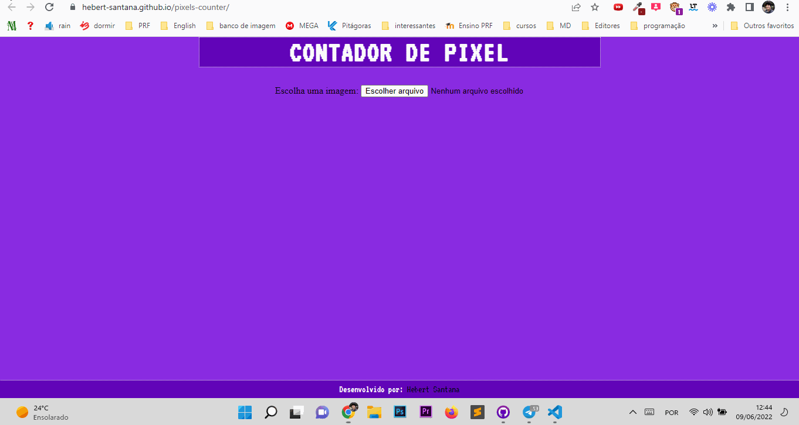

# CONTADOR DE PIXELS
## Projeto (finalizado :white_check_mark:)

A ideia do projeto é você carregar uma imagem qualquer (.PNG ou .JPG) e retornar a quantidade de <strong>PIXELS</strong> há na imagem e especificar quantos PIXELS de cada cor há na imagem carregada.

## 🛠️ Recursos

* HTML
* CSS
* Javascript

## 💻 Demonstração
 

 
 

<https://hebert-santana.github.io/pixel-counter/>

## Autor
~~~ javascript
Hebert Santana
~~~

