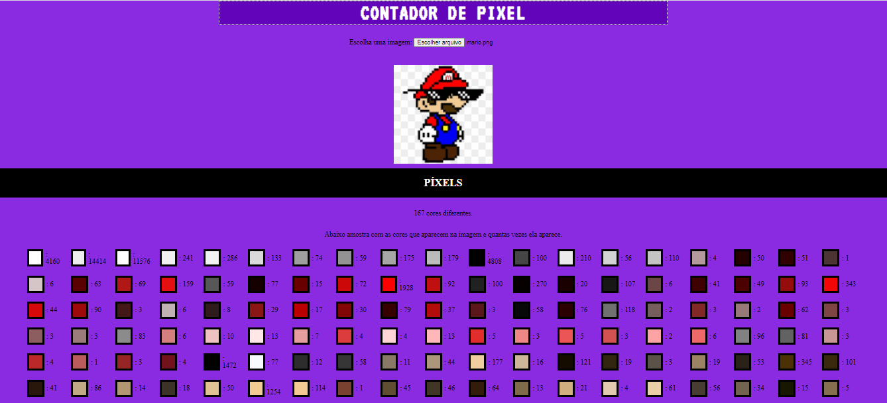

# CONTADOR DE PIXELS

A ideia do projeto é você carregar uma imagem qualquer (.PNG ou .JPG) e retornar a quantidade de PIXELS há na imagem e especificar quantos PIXELS de cada cor há na imagem carregada.

<h1> Demonstração </h1>

~~~ javascript

by Hebert Santana

~~~~

